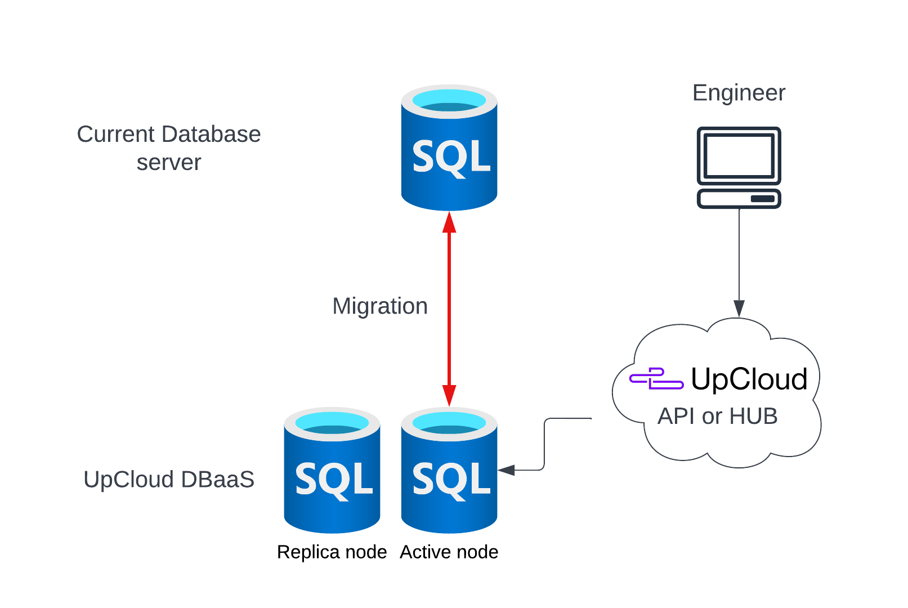

# DBaaS Migration tools
This repository contains examples on how to migrate your database to UpCloud DBaaS service. We have separated examples to different
directories based on Database type.

## Getting started
- [MySQL](mysql/) has examples for MySQL migration
- [PostgreSQL](postgresql/) has examples for PostgreSQL migration

## Introduction to Migration Wizard

https://user-images.githubusercontent.com/70132780/203916741-0a15dd49-fa3b-4517-ac1e-fa221c1ae950.mp4

