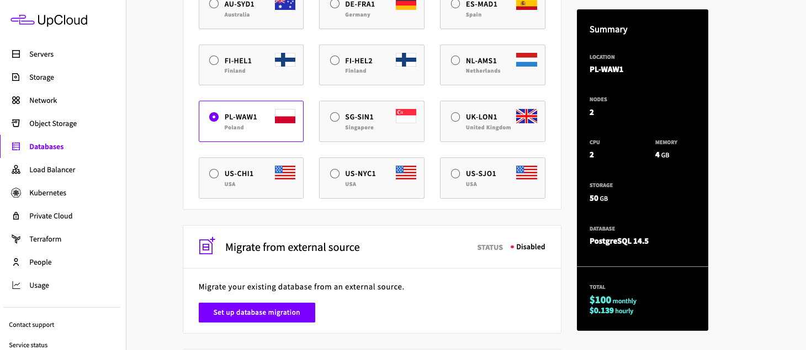
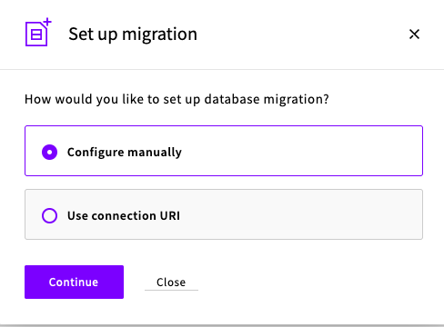
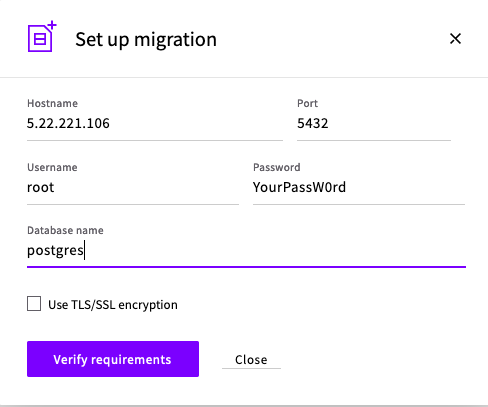
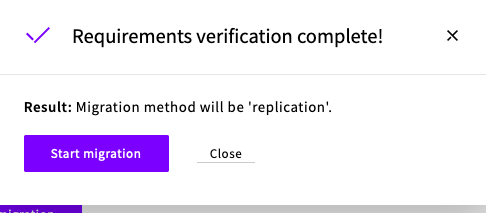
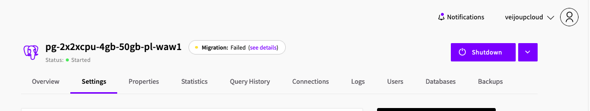
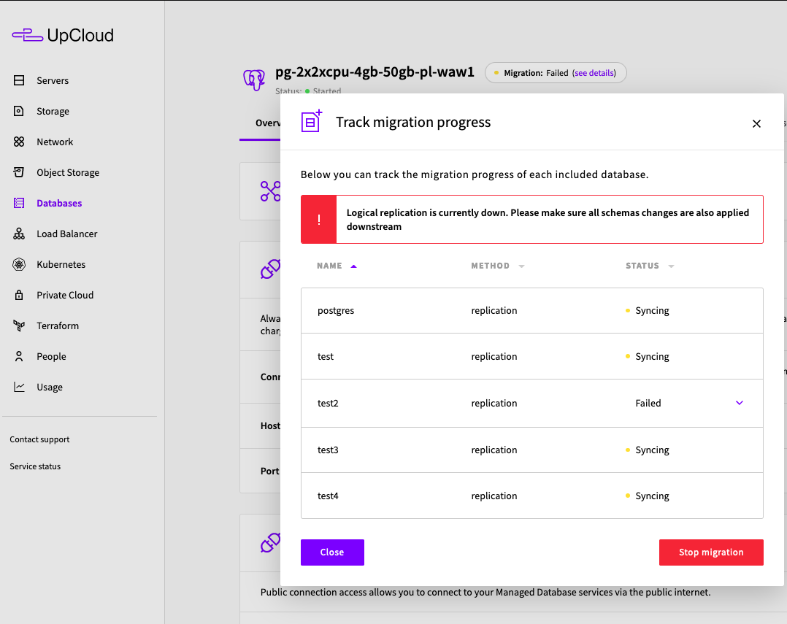
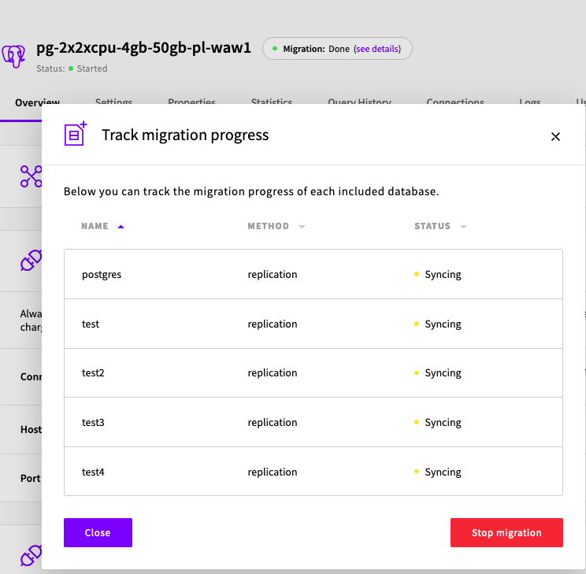
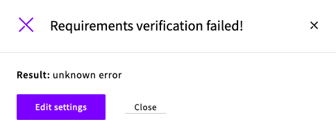

# PostgreSQL examples
Database migration feature can be used to migrate your current PostgreSQL databases to UpCloud DBaaS. 
Feature supports both logical replication and using a dump and restore process. Please test migration 
feature before using it in production enviroment. You should always have backup available in case something goes wrong with migration.

Logical replication is the default method and once successfully set up, this keeps the two databases synchronized until 
the replication is interrupted. If the preconditions for logical replication are not met, 
the migration falls back to using pg_dump.

Regardless of the migration method used, the migration feature first performs a schema dump and migration to ensure schema compatibility.
## Requirements

Your PostgreSQL server needs to publicly available or it needs to be attached to Upcloud Utility network.
You also need to have superuser with access to login to source database server from UpCloud DBaaS active node.
This superuser needs to be configured to `pg_hba.conf`.

### Requirements for logical replication

- Requires PostgreSQL 10 or newer
 - Please use same PostgreSQL major version for source and destination when possible
- `wal_level` needs to be `logical`
- Supports only FOR ALL TABLES publication in source
- Migration requires replication slots so if you are already using all of them you need to increase replication slots
- You need superuser or superuser-like privileges in both source and target database. 
  - Or you can use [aiven-extras](https://github.com/aiven/aiven-extras) extension 

## Handling the migration
Logical replication is the default method which keeps the two databases synchronized until the replication is interrupted.
If the preconditions for logical replication are not met for a database, the migration falls back to using `pg_dump`.

You will need to manually create all existing users to UpCloud DBaaS cluster. You can do this via UpCloud HUB. After migration is finished 
you will need to change DNS settings or software settings to connect to UpCloud DBaaS cluster instead of old database server. 

## Hub usage
You can find Migration feature from Settings tab of DBaaS page.

You can choose to use URI with necessary parameters or manual configuration.

You will need to add source database server public hostname or IP, PostgreSQL port, username and password and database that is used for initial connection.

UpCloud will verify if migration is possible and what is the preferred method. 

Migration status is visible on top of page. PostgreSQL migration might initially fail, but it is retried so you should wait for a while if migration is working.

You can track migration in more detail from migration progress window and in this case replication failed for one database which is why status is failed.

After waiting a while migration is restarted and this time all databases get synced and data migration is done and replication will continue to sync the data.

## Bash script usage 

We have provided you with following bash scripts `start-migration.sh`, `start-migration-pre-checks.sh`, `disable-replication.sh` and `create-dbaas-and-migrate.sh` that can be used to 
migrate your database to UpCloud DBaaS. You can monitor migration status and UpCloud DBaaS status with `monitor-dbaas.sh`. 

You can migrate your database to UpCloud DBaaS with `create-dbaas-and-migrate.sh` if you need to create the UpCloud DBaaS service at the same time. If you 
have existing UpCloud DBaaS or you want to create it via [UpCloud Control Panel](https://hub.upcloud.com/) you can use `start-migration.sh` script. 

You should use `start-migration-pre-checks.sh` script to check if migration settings are correct and what migration method is recommended. 
This script is also useful when debugging issues with migration.

### Bash script example
First you need to define your UpCloud HUB/API username and password as environment variable to allow included scripts to work.
```
export UPCLOUD_USERNAME=Your_username
export UPCLOUD_PASSWORD=Your_password
```

You should start by validating you migration setting before migration with `start-migration-pre-checks.sh`
```
bash start-migration-pre-checks.sh -u 09f22e89-13a4-4e1f-95fd-ac613707145a -U superuser -p YourPassW0rd -P 5432 -d postgres -m replication -s true -H 5.22.221.106 
Creating migration check task… 

Success: migration check task created
id: 253d883b-ef34-4db4-a71c-2456dfed3ba9 

Polling for migration check task result... 

Task Result : poll #1 
{
  "create_time": "2022-10-31T10:37:56Z",
  "operation": "pg_migration_check",
  "id": "253d883b-ef34-4db4-a71c-2456dfed3ba9",
  "result_codes": [],
  "result": "Migration method will be 'replication'.",
  "success": true
}


migration check task completed

```
Then you can use `start-migration.sh` to start actual migration.

```
bash start-migration.sh -u 09fc3cec-fa71-4979-8aa3-ec7594cb944d -H 5.22.221.106 -U superuser -p YourPassW0rd -P 5432 -s false -d postgres 
{
  "backups": [
    {
      "backup_time": "2022-10-10T12:40:20.672000Z",
      "data_size": 36259840
    }
  ],
  "components": [
    {
      "component": "pg",
      "host": "upcloud-test-mystmtdaytdt.db.upclouddatabases.com",
      "port": 11550,
      "route": "dynamic",
      "usage": "primary"
    },
     ... API response about DBaaS service ...
  "properties": {
    "automatic_utility_network_ip_filter": true,
    "ip_filter": [],
    "max_replication_slots": 40,
    "migration": {
      "dbname": "postgres",
      "host": "5.22.221.106",
      "password": "YourPassW0rd",
      "port": 5432,
      "ssl": false,
      "username": "superuser"
    },
    "public_access": true,
    "version": "13"
  },
       ... API response about DBaaS service ...
  "zone": "pl-waw1"
}

```

You can then monitor migration status with `monitor-dbaas.sh`
```
bash monitor-dbaas.sh -u 09fc3cec-fa71-4979-8aa3-ec7594cb944d
{
  "error": "Failed to run query on source db: 'unknown error'",
  "method": "",
  "seconds_behind_master": 0,
  "source_active": false,
  "status": "done",
  "databases": []
}

```
With logical replication you need to wait for logical replication to finnish. Some cases you might need to disable
and enable migration few times before all databases are in sync.

```
{
  "error": "Logical replication is currently down. Please make sure all schemas changes are also applied downstream",
  "method": "replication",
  "seconds_behind_master": 0,
  "source_active": true,
  "status": "failed",
  "databases": [
    {
      "dbname": "test2",
      "error": "Logical replication is currently down. Please make sure all schemas changes are also applied downstream",
      "method": "replication",
      "status": "failed"
    },
    {
      "dbname": "test1",
      "error": "Logical replication is currently down. Please make sure all schemas changes are also applied downstream",
      "method": "replication",
      "status": "failed"
    },

    {
      "dbname": "postgres",
      "method": "replication",
      "status": "syncing"
    },
    {
      "dbname": "test3",
      "error": "Logical replication is currently down. Please make sure all schemas changes are also applied downstream",
      "method": "replication",
      "status": "failed"
    }
  ]
}
...
{
  "method": "replication",
  "seconds_behind_master": 0,
  "source_active": true,
  "status": "done",
  "databases": [
    {
      "dbname": "postgres",
      "method": "replication",
      "status": "syncing"
    },
    {
      "dbname": "test3",
      "method": "replication",
      "status": "syncing"
    },
    {
      "dbname": "test1",
      "method": "replication",
      "status": "syncing"
    },
    {
      "dbname": "test2",
      "method": "replication",
      "status": "syncing"
    }
  ]
}
```

If you do not have DBaaS running you can create and start migration by running script `create-dbaas-and-migrate.sh`
```
bash create-dbaas-and-migrate.sh -n upcloud-test -S 2x2xCPU-4GB-50GB -z pl-waw1 -H 5.22.221.106 -U superuser -p YourPassW0rd -P 5432 -s false -d postgres -v 13
{
  "backups": [],
  "components": [
    {
      "component": "pg",
      "host": "upcloud-test-mystmtdaytdt.db.upclouddatabases.com",
      "port": 11550,
      "route": "dynamic",
      "usage": "primary"
    },
  ... API response about created DBaaS service ...
  "zone": "pl-waw1"
}
UUID of created DBaaS service:
09fc3cec-fa71-4979-8aa3-ec7594cb944d
```

Once migration is completed (`"status": "done"`) you can move SQL queries to new DBaaS service and can disable replication with `disable-replication.sh`
```
bash disable-replication.sh -u 09fc3cec-fa71-4979-8aa3-ec7594cb944d
```

Please note that migration does not transfer users of source database server so you will need to create users to 
DBaaS via UpCloud Hub.

#### create-dbaas-and-migrate.sh
This script creates DBaaS and starts migration from source database server to new DBaaS system. 

```
Usage:
    create-dbaas-and-migrate.sh [ Options]
    Required options:
      -n <Upcloud DBaaS hostname>
      -S <UpCloud DBaaS plan size>
      -z <UpCloud zone/Datacenter>
      -H <Hostname or IP address of server where to migrate data from>
      -U <Username for authentication with server where to migrate data from>
      -p <Password for authentication with the server where to migrate data from>
      -P <Port number of the server where to migrate data from>
      -m <Migration method. Value dump or replication>
      -s <Should we use SSL connection to source server during migration. Value true or false>
    Secondary options:
      -i <Comma separated list of databases to ignore>
      -d <Database name of bootstrapping the initial connection>
    Example:
      create-dbaas-and-migrate.sh -n updcloud-dbaas -S 2x2xCPU-4GB-50GB -z pl-waw1 -H yoursourceserver.com -U root -p YourPassW0rd -P 5432 -m dump -s false
    Use -h for infromation about this script.
```

#### start-migration-pre-check.sh
This script validates your migration settings and is helpful when debugging issues with migration.
```
Usage:
    start-migration-pre-check.sh [ Required options]
    Required options:
      -u <UpCloud DBaaS UUID>
      -H <Public Hostname or IPv4 address of server where to migrate data from>
      -U <Username for authentication with server where to migrate data from>
      -p <Password for authentication with the server where to migrate data from>
      -P <Port number of the server where to migrate data from>
      -m <Migration method. Value dump or replication>
      -s <Should we use SSL connection to source server during migration. Value true or false>
    Secondary options:
      -d <Database name of bootstrapping the initial connection>
    Example:
      start-migration-pre-check.sh -u 09352622-5db9-4053-b3f2-791d3f8c8f63 -H yoursourceserver.com -U root -p YourPassW0rd -P 5432 -d postgres -m replication -s true
    Use -h for infromation about this script.
    
```

#### start-migration.sh
This script can be used to start migration to UpCloud DBaaS service that is already running.
```
Usage:
    start-migration.sh [ Required options]
    Required options:
      -u <UpCloud DBaaS UUID>
      -H <Hostname or IP address of server where to migrate data from>
      -U <Username for authentication with server where to migrate data from>
      -p <Password for authentication with the server where to migrate data from>
      -P <Port number of the server where to migrate data from>
      -m <Migration method. Value dump or replication>
      -s <Should we use SSL connection to source server during migration. Value true or false>
    Secondary options:
      -i <Comma separated list of databases to ignore>
      -d <Database name of bootstrapping the initial connection>
    Example:
      start-migration.sh -u 09352622-5db9-4053-b3f2-791d3f8c8f63 -H yoursourceserver.com -U root -p YourPassW0rd -P 3306 -d defaultdb -m replication -s false
    Use -h for infromation about this script.
```

#### disable-replication.sh
This script can be used to disable replication when you are using replication method for migration.

```
Usage:
    disable-replication.sh [ Required options]
    Options:
      -u <UpCloud DBaaS UUID>
    Example:
      disable-replication.sh -u 09352622-5db9-4053-b3f2-791d3f8c8f63
    Use -h for infromation about this script
```

#### monitor-dbaas.sh
This script can be used to monitor UpCloud DBaaS service and migration status.
```
Usage:
    monitor-dbaas.sh [ Required options]
    Options:
      -u <UpCloud DBaaS UUID>
    Example:
      monitor-dbaas.sh -u 09352622-5db9-4053-b3f2-791d3f8c8f63
    Use -h for infromation about this script

```

## Troubleshooting
If you are having issues with the migration you should check PostgreSQL logs in source server and DBaaS logs in UpCloud Hub.
### DBaaS active node is unable to login to source database
After you have enabled migration you might see postgresql log something similar this:
```
2022-10-10 10:38:21.184 UTC [8823] superuser@test FATAL:  no pg_hba.conf entry for host "5.22.221.26", user "superuser", database "test3", SSL on
2022-10-10 10:38:21.188 UTC [8824] superuser@test FATAL:  no pg_hba.conf entry for host "5.22.221.26", user "superuser", database "test3", SSL off
2022-10-10 10:39:10.802 UTC [8838] superuser@test FATAL:  no pg_hba.conf entry for host "5.22.221.26", user "superuser", database "test3", SSL on
2022-10-10 10:39:10.804 UTC [8839] superuser@test FATAL:  no pg_hba.conf entry for host "5.22.221.26", user "superuser", database "test3", SSL off
```
This means that DBaaS active node is trying to login to your database server and you need to allow connection from IP address of active node.

### Migration fails for some reason
If migration initially fails you should disable the migration and fix issues preventing from migration to continue.

#### Migration verification fails


Most common reason for migration failure is that DBaaS active node is unable to log in to source database server. 
You should check if credential are correct and user is allowed to log in from IP of active DBaaS node. 
#### One or more of databases fail due to PostgreSQL migration slots
If you are getting following or similar error. 
```
| timestamp: 2022-10-17T07:10:47.155108Z | hostname: updcloud-dbaas-3 | service: postgresql-13.service |
[1389-2] pid=1700840,user=,db=,app=,client= HINT: You might need to increase max_logical_replication_workers.
| timestamp: 2022-10-17T07:10:47.155053Z | hostname: updcloud-dbaas-3 | service: postgresql-13.service |
[1388-1] pid=1700840,user=,db=,app=,client= WARNING: out of logical replication worker slots
```
You will need to check `max_logical_replication_workers` and `max_replication_slots` in Properties tab and increase the value.
You also might need to increase same values in source database server.

#### Migration initially fails with some databases 
Often initially migration status is failed and many databases are in failed state, but
after migration has been running for a while databases are able to sync.
```
bash monitor-dbaas.sh -u 09c4f808-e454-4f70-a9a9-003a98ea82c2   
{
  "error": "Logical replication is currently down. Please make sure all schemas changes are also applied downstream",
  "method": "replication",
  "seconds_behind_master": 0,
  "source_active": true,
  "status": "failed",
  "databases": [
    {
      "dbname": "test3",
      "error": "Logical replication is currently down. Please make sure all schemas changes are also applied downstream",
      "method": "replication",
      "status": "failed"
    },
    {
      "dbname": "test",
      "error": "Logical replication is currently down. Please make sure all schemas changes are also applied downstream",
      "method": "replication",
      "status": "failed"
    },
    {
      "dbname": "test2",
      "error": "Logical replication is currently down. Please make sure all schemas changes are also applied downstream",
      "method": "replication",
      "status": "failed"
    },
    {
      "dbname": "postgres",
      "method": "replication",
      "status": "syncing"
    },
    {
      "dbname": "test4",
      "error": "Logical replication is currently down. Please make sure all schemas changes are also applied downstream",
      "method": "replication",
      "status": "failed"
    }
  ]
}
...
{
  "method": "replication",
  "seconds_behind_master": 0,
  "source_active": true,
  "status": "done",
  "databases": [
    {
      "dbname": "test",
      "method": "replication",
      "status": "syncing"
    },
    {
      "dbname": "test2",
      "method": "replication",
      "status": "syncing"
    },
    {
      "dbname": "postgres",
      "method": "replication",
      "status": "syncing"
    },
    {
      "dbname": "test3",
      "method": "replication",
      "status": "syncing"
    },
    {
      "dbname": "test4",
      "method": "replication",
      "status": "syncing"
    }
  ]
}

```
#### PostgreSQL publication exits in table
If you get following error logs in source database server 
```
2022-10-10 10:46:26.684 UTC [8995] superuser@test ERROR:  publication "aiven_db_migrate_ad0234829205b9033196ba818f7a872b_pub" already exists
2022-10-10 10:46:26.684 UTC [8995] superuser@test STATEMENT:  CREATE PUBLICATION aiven_db_migrate_ad0234829205b9033196ba818f7a872b_pub FOR ALL TABLES WITH (publish = 'INSERT,UPDATE,DELETE,TRUNCATE')
```
This means migration started but something when wrong with it. You can try again by disabling migration or if that is 
no longer possible due to deleting DBaaS service then you need to check if any migration publication exists.
```
test=# select * from pg_catalog.pg_publication; 
  oid  |                        pubname                        | pubowner | puballtables | pubinsert | pubupdate | pubdelete | pubtruncate | pubviaroot 
-------+-------------------------------------------------------+----------+--------------+-----------+-----------+-----------+-------------+------------
 17274 | aiven_db_migrate_098f6bcd4621d373cade4e832627b4f6_pub |    16387 | t            | t         | t         | t         | t           | f
(1 row)
```
and drop these with
```
DROP PUBLICATION IF EXISTS aiven_db_migrate_098f6bcd4621d373cade4e832627b4f6_pub;
```
And now you can start to enable migration again.

